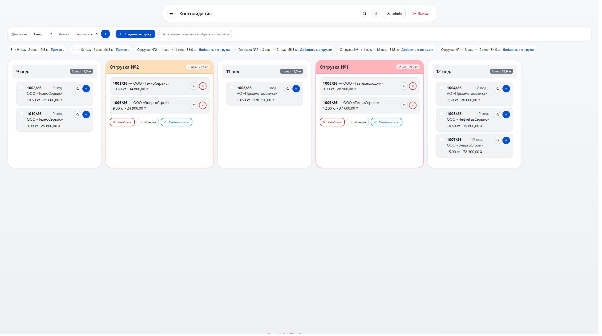

# Consolida

> Система управления заказами, консолидации поставок и отслеживания отгрузок.

[](https://dotnet.microsoft.com/)
[](https://www.postgresql.org/)
[](https://redis.io/)
[](https://docs.docker.com/compose/)
[](LICENSE)

---

## О проекте

**Consolida** — внутренний инструмент отдела логистики: оформление заказов на поставку,
расчёт стоимости с налогами, маржой, пошлинами ТН ВЭД и доставкой, объединение
заказов в **пулы** (группы, которые едут одним маршрутом) и отслеживание отгрузок.

Пет-проект. Задача была — собрать полноценную слоистую архитектуру на .NET
и потрогать разные подходы к кэшированию, блокировкам, фоновым задачам и real-time.

### Что реально показывает код

- **Слоистая архитектура** с жёстким направлением зависимостей: `Web → Application → DB`.
- **UnitOfWork + Repository + Generic Service** — без дублирования в 10+ сервисах.
- **Soft delete** везде, включая каскадное удаление по графу сущностей.
- **Двухуровневые блокировки**: оптимистичные на Postgres `xmin` + TTL-локи на уровне приложения.
- **Real-time Kanban** консолидации через SignalR.
- **Hangfire**: ежедневные email-уведомления о доставке и очистка просроченных локов.
- **Strategy-кэш**: Memory и Redis переключаются одной строкой в `.env`.
- **FilterService на Expression Trees** — динамические фильтры и сортировка без ручных `switch`.
- **Excel**: импорт заказов из формы ответа + экспорт ТКП и расчёта через ClosedXML.
- **Identity с кастомными permission-claim'ами** — гибче, чем встроенные роли.
- **Тесты**: unit (Moq + MockQueryable) + integration (Sqlite in-memory, полная схема БД).

---

## Скриншоты

**Kanban-доска консолидации** — drag-and-drop, подсказки объединения,
real-time локи и presence через SignalR.



---

## Технологии

| Слой | Технология |
| --- | --- |
| Runtime | .NET 10, ASP.NET Core MVC |
| ORM | EF Core 10 + Npgsql |
| БД | PostgreSQL 16 |
| Кэш | Redis (опционально) / IMemoryCache |
| Real-time | SignalR |
| Фоновые задачи | Hangfire + PostgreSQL storage |
| Логирование | Serilog (файл + консоль + JSON в Docker) |
| Аутентификация | ASP.NET Core Identity |
| Email | MailKit |
| Excel | ClosedXML |
| UI | Razor Views, Bootstrap 5, jQuery |
| Тесты | xUnit, Moq, FluentAssertions, MockQueryable, Sqlite in-memory |
| Развёртывание | Docker, Docker Compose |
| CI | GitHub Actions |

---

## Структура решения
```
Consolida/
├── Consolida/ # Web-слой (MVC + API + Razor + wwwroot)
├── Application/ # Бизнес-логика
│ ├── DataAccessLayer/
│ │ ├── Interface/ # Абстракции (IRepository, IUnitOfWork, сервисы)
│ │ ├── Service/ # Реализации сервисов
│ │ ├── CacheService/ # Facade-кэши по сущностям
│ │ ├── Jobs/ # Hangfire-задачи
│ │ └── Hubs/ # SignalR Hub + Notifier
│ └── ViewModels/ # DTO и модели представлений
├── DB/ # Данные (Entities, AppDbContext, Migrations, Seeder)
├── Tests/
│ ├── Consolida.UnitTests/
│ └── Consolida.IntegrationTests/
├── docs/ # ARCHITECTURE.md, PATTERNS.md, TRADE-OFFS.md, screenshots
├── Dockerfile
├── docker-compose.yml
├── Makefile / make.bat
└── .github/workflows/ci.yml
```

Зависимости идут в одну сторону: `Consolida` → `Application` → `DB`.

---

## Быстрый старт

### Локальный запуск (без Docker)

**Требуется:** .NET 10 SDK, PostgreSQL 16 (или Docker для БД).

```bash
git clone https://github.com/Dimo4ka174/Consolida.git
cd Consolida
dotnet build
dotnet run --project Consolida
```

Миграции и сиды применяются автоматически. Приложение поднимется на http://localhost:5599

**Учётные записи из сидера** (пароль у всех — `root`):

| Логин | Роль |
| --- | --- |
| `admin` | Администратор |
| `manager` | Менеджер |
| `director` | Директор |

### Через Docker

```bash
cp .env.example .env
# заполнить POSTGRES_PASSWORD и (при необходимости) REDIS_PASSWORD
docker compose up -d --build
```

Приложение — http://localhost:5000, Hangfire dashboard — http://localhost:5000/hangfire (доступен только с localhost).

### Через Makefile

Для удобства есть Makefile (Linux/macOS) и make.bat (Windows).
```bash
make help                 # список команд
make build                # собрать в Release
make run                  # запустить локально
make test                 # все тесты
make test-unit            # только unit
make test-integration     # только integration
make coverage             # тесты с покрытием
make docker-up            # поднять compose
make docker-down          # остановить
```

На Windows — make.bat help, make.bat build и т. д.

---

## Тесты

```bash
# Всё
dotnet test

# Только unit
dotnet test Tests/Consolida.UnitTests

# Только integration
dotnet test Tests/Consolida.IntegrationTests

# С покрытием
dotnet test --collect:"XPlat Code Coverage" --results-directory ./TestResults
```
Что покрыто намеренно: бизнес-логика, где ошибка не видна глазом — генератор
номеров заказов, расчёт стоимости, уведомления, консолидация, каскадное soft delete.

Что не покрыто: CRUD справочников и контроллеры. Там нет логики, которую можно
незаметно сломать, а тесты на «работает ли AutoMapper» ценность близка к нулю.

---

## Конфигурация

**Обязательные:**

| Переменная | Описание |
| --- | --- |
| `ConnectionStrings__DefaultConnection` | Строка подключения к PostgreSQL |

**Опциональные:**

| Переменная | Описание |
| --- | --- |
| `REDIS_HOST` / `REDIS_PORT` / `REDIS_PASSWORD` | Redis. Пусто → in-memory кэш |
| `EmailSettings__SmtpServer` | SMTP для уведомлений о доставке |
| `EmailSettings__ToEmail` | Кому слать уведомления |
| `DATA_PROTECTION_PATH` | Каталог ключей Data Protection |

---

## Документация

docs/ARCHITECTURE.md — слои, поток запроса, ключевые решения.
docs/PATTERNS.md — использованные паттерны с примерами из кода.
docs/TRADE-OFFS.md — известные компромиссы и техдолг.

---

## Статус и планы
В активной разработке. Код открыт для ознакомления (см. LICENSE).

Планы:
E2E-тесты на Playwright (создание заказа → консолидация → ТКП).
Экспорт в PDF.
CQRS-выделение read-моделей для доски и списков.

---

## Автор

**Дмитрий Харченко** — C#/.NET разработчик.

- GitHub: [@Dimo4ka174](https://github.com/Dimo4ka174)
- Email: `Dmitry.Kharchenko.Dev@yandex.ru`

> Это личный pet-проект. Он не связан с коммерческой деятельностью организаций, не содержит кода или данных третьих лиц.

---
